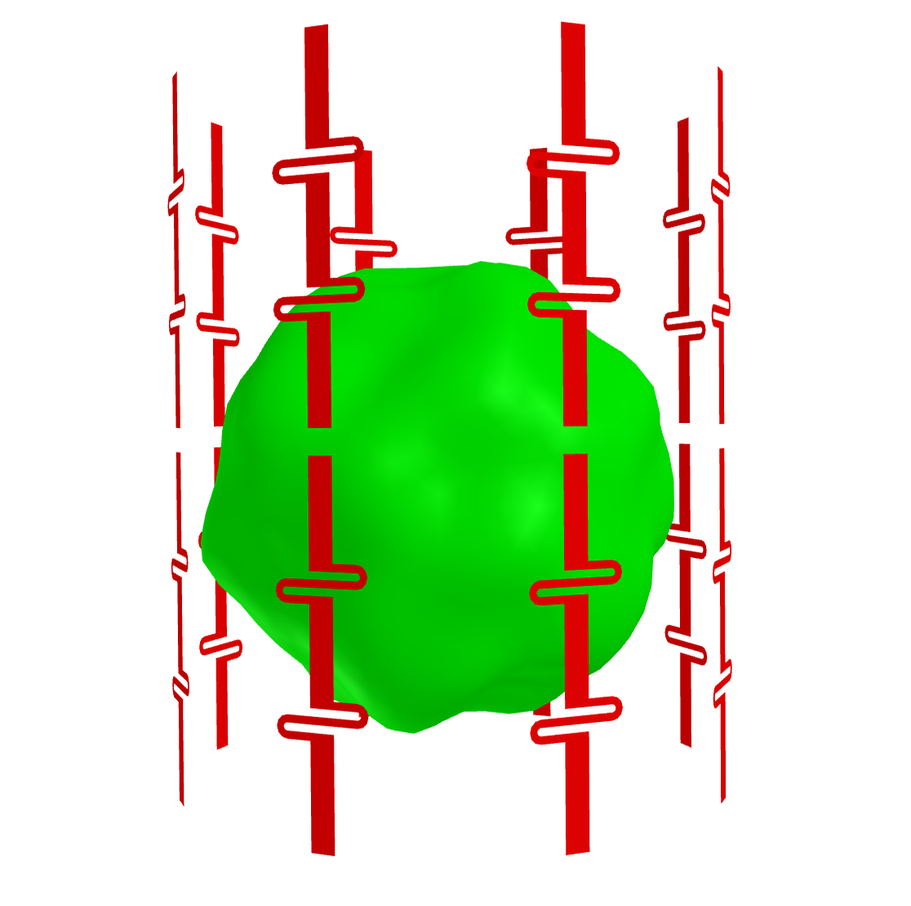
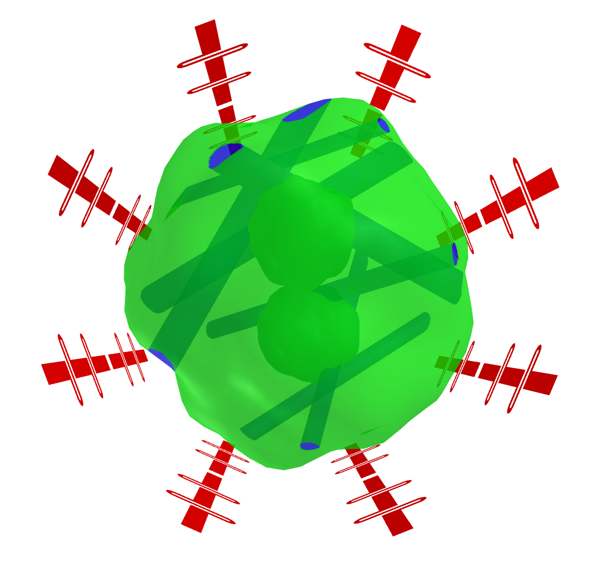
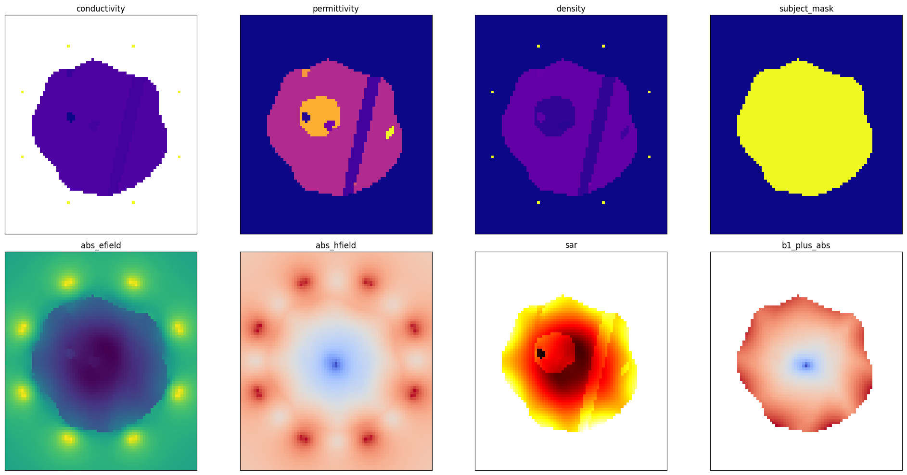
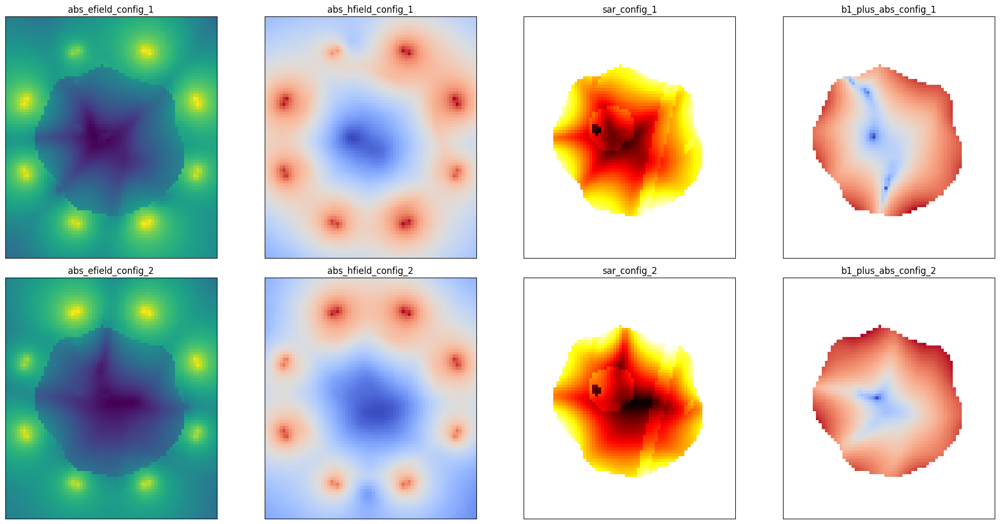

# Hackathon 
### Spring School on *Physics Informed Machine Learning for Medical Sciences*
Welcome to the Hackathon accompanying the 2025 Spring School on *Physics Informed Machine Learning for Medical Sciences*.

This repo will serve you as a starting point for solving the task described below.

## Getting Started
To setup the environment, fork this repository (or create a new one using this repository as a template) and clone the repository.

In the new repository create a new environment and install all requirements by running the following commands:
```
python -m venv .venv
source .venv/bin/activate
pip install -r requirements.txt
```

## Problem setting
You are given a complex 3D object sitting inside an array of 8 dipoles, positioned radially around the object as seen in Figure 1.

 
<p float="left">
  
   
</p>

**Figure 1:** Coil and object positions.


The domain is a simulated MRI environment with electric $E$ and magnetic $H$ field already calculated at each point using the CST studio suite and exported at a voxel size of 4mm. The contribution of each dipole $i$ is calculated and stored separately $E_i, H_i$, and the total fields are the sum of the contributions of each dipole $E = \sum_{i=1}^8 E_i$ and $H = \sum_{i=1}^8 H_i$.

Additionally, the object mask and various physical properties (electrical conductivity, magnetic permittivity and density) are also available as seen in Figure 2.



**Figure 2:** Example simulation with physical features and distribution of electric and magnetic fields.

When the phase and amplitude for a specific dipole $i$ is changed to $\varphi$ and $A_i$ respectively, the resulting contribution of this dipole can then be calculated as 
$$
\hat{E_i} = A_i e^{i\varphi} E_i\\
\hat{H_i} = A_i e^{i\varphi} H_i 
$$

This can significantly change the overall distribution of the fields and in result, the distribution of the SAR and the $B_1^+$ field (which directly corresponds to what the MRI scanner can register). See Figure 3 for an example.



**Figure 2:** Example distribution of Fields, SAR and the $B_1^+$ field for two different coil configurations.

### Task description

Your task is to optimize the phase and amplitude of the coils (coil configuration) with respect to a specified cost function (e.g. $B_1$ homogeneity, minimal peak SAR etc.). 

For the purposes of this task we consider two cost functions:

#### B1 Homogeneity
Given the $B_1^+$ Field calculated as $B_x + i*B_y$ we consider the cost function:

$$\text{cost}_1(\varphi, A) = \frac{\text{mean}(|B_1^+|)}{\text{std}(|B_1^+|)}$$

This cost function maximizes the mean strength of the $B_1^+ Field$, while simultaneously minimizing the variability of the field within the subject.
The task is to maximize this cost function.

#### B1 Homogeneity with SAR constraint
Additionally, we also consider the cost function which maximizes the $B_1^+$ Homogeneity, while also minimizing the peak SAR.
The cost function is given by

$$\text{cost}_2(\varphi, A) = \frac{\text{mean}(|B_1^+|)}{\text{std}(|B_1^+|)} + \lambda \frac{1}{SAR}$$

Where $\lambda$ is an additional weighting factor and $\text{SAR}(x)$ is the Specific Absorption Rate at a certain point in space given by:

$$\text{SAR}(x) = \frac{|E(x)|^2\cdot\sigma(x)}{\rho(x)}$$

with $\sigma(x)$-electric conductivity and $\rho(x)$-mass density

## Data
You can download the data from [Google Drive](https://drive.google.com/drive/folders/17yIm9Pjc1QsyB-fAGvf5FCk9AmqIDXUW?usp=drive_link)

Place the data directory in the main directory of the project. It should look something like this:

```plaintext 
project/ 
├── ...
├── data/
│ ├── simulations/
│ │ ├── sim1.h5     
│ │ ├── sim2.h5     
│ │ └── ...     
│ └── antenna/
│ │ └── antenna.h5     
└── ...
```

## Evaluation
All teams will be asked to submit their solutions as a git repository. In the git repository the `main.py` should be modified (only) to include the optimization algorithm developed by the team. The `evaluation.py` script should not be changed at all.

Each submission will be evaluated on a previously unseen set of simulations, with both cost functions specified in the task. The optimization algorithm should run within 5 Minutes after which the program execution will timeout and the solution will be disqualified.
 
## Ideas where to go from here
- Implement parallel processing during optimization
- Speed up the calculation of phase-shifted fields
- Run pytorch (or other DL software) to use gradient descent for local optimization
- Try out different global optimization algorithms